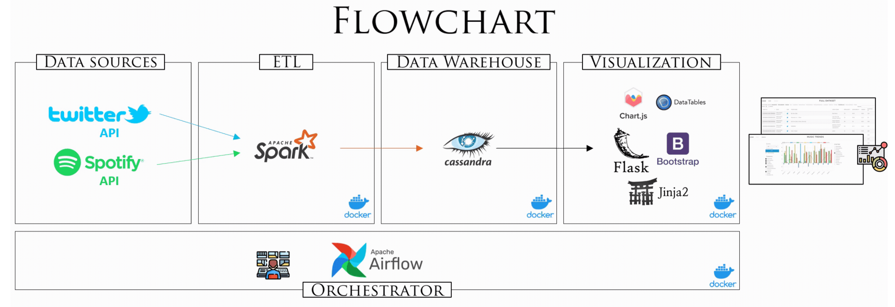
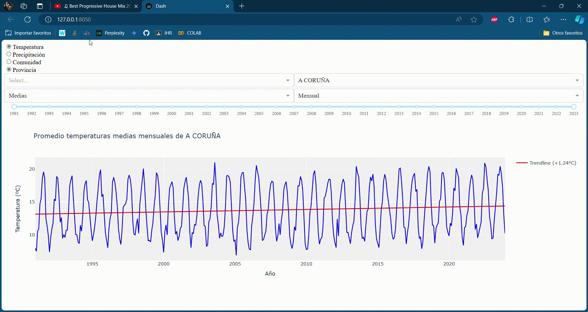

# 

<strong>Proyecto Apache Spark</strong>

## 
Introducción

En este proyecto, se aborda el diseño y la implementación de una solución integral para la extracción, procesamiento, almacenamiento y visualización de datos provenientes de la Agencia Estatal de Meteorología Española (AEMET). El flujo de trabajo se estructura en cuatro etapas principales: *data sources*, *ETL*, *data warehouse* y *visualization*. Cada una de estas etapas está orquestada y gestionada mediante Apache Airflow.

Más información sobre el proyecto se puede encontrar en la [documentación](./Memoria.ipynb).

